# Honest Piranha

This is a landing page I've created in the MERN stack for my YouTube videos and podcasts. I created this to solve several problems I see when trying to create a personal "brand" for online entertainment.

1. Because online entertainers may need to utilize multiple services (in my case, YouTube for video and Anchor for podcasts) it can be nice to have one place to group everything together.
1. Platforms don't always let you display your content the way you would like to. By creating my own site and embedding players from these platforms, I have a lot more control over the way my projects are presented.
1. The signal to noise ratio in platform comment sections can be heavily skewed toward the noise, particularly when platforms don't present any barrier to entry. On my platform, there is a sign-up process to leave comments to dissuade people from leaving unproductive or toxic comments. However, users do not need to sign-up or log in to view or listen to the content.
1. This platform features a comment curating system that requires comments be approved before they are displayed. This prevents hate-speech and other undesirable content from appearing on my platform.

In this document, I'm going to show you how the front-end works. It's my hope that by showing off the features of the site, it will be easy for anyone who wants to use this platform to adapt it to their needs as well.

## Visitor Features

Anyone who comes to the site can enjoy the content and navigate through the site without needing to log in or sign up.

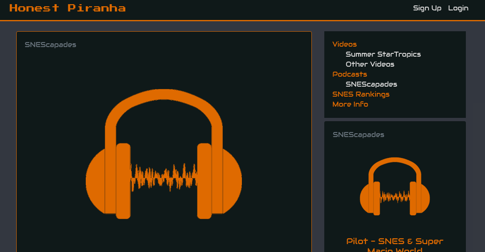

Visitors can view all entries in a specific series by clicking on the link in the menu. They can also view all entries that are videos or podcasts by clicking on the appropriate link.

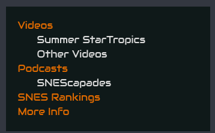

When a visitor selects an entry from the main menu, they'll be redirected to a page for that entry where they can play the video or podcast and view comments below if there are approved comments for that particular entry.

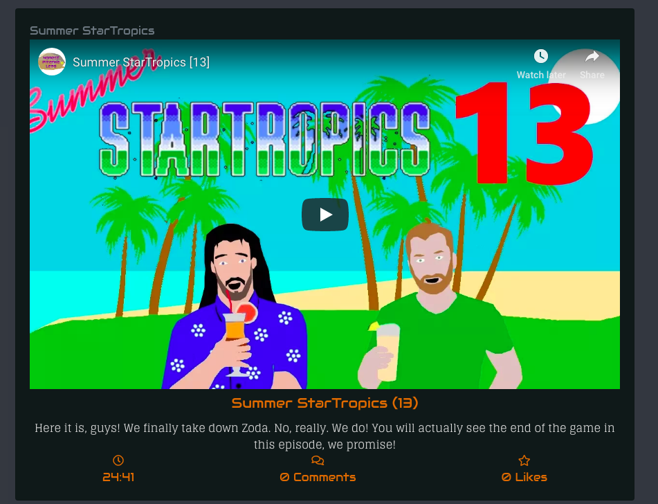

If a visitor has an account, they can log in using the "Login" link in the navbar. If they don't have an account, they can create one using the "Sign Up" link.

## User Features

### Comments

Users who register an account and sign in will have access to the comment section. They can leave a comment and submit it under any entry in that entry's page. Please note that comments must be approved by an administrator before they will appear.

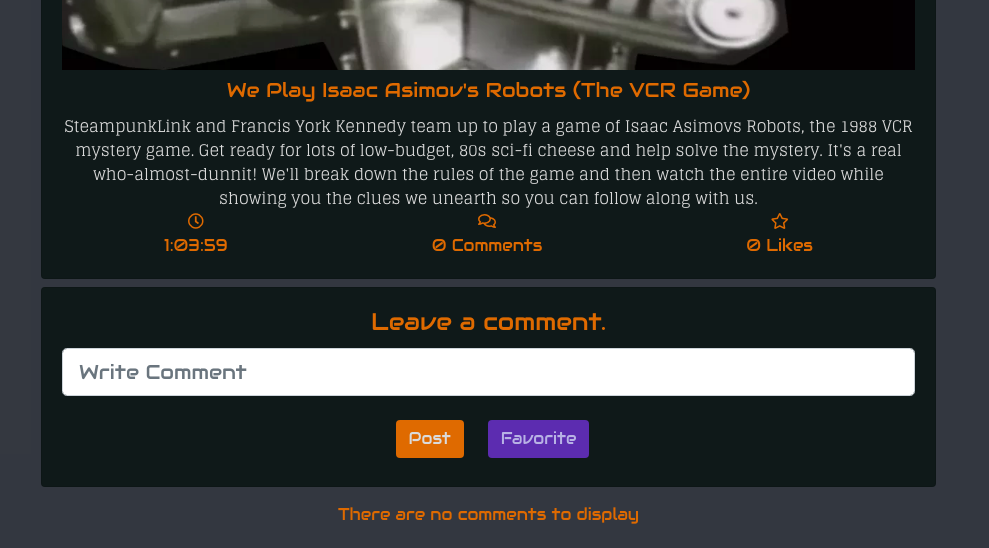

When a user is logged in, their name will appear in the navbar as will an option to logout instead of the "Sign Up" and "Login" links.

Users can go to their dashboard by clicking on their name in the nav.

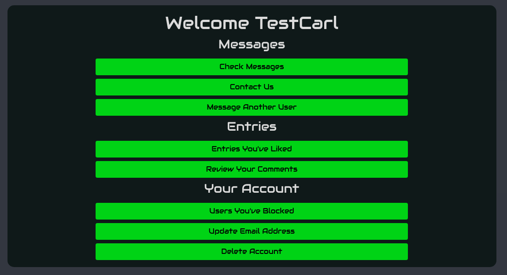

### Private Messages

Users have the option to send other users a private message. They can check their own messages with the first option. They can send a message to the site directly with the "Contact Us" option. This will generate a special type of message called a "Ticket" that can be viewed by anyone with an admin account. "Message Another Message" will allow the user to compose a message and send it to another user.

It should be noted that we want to protect the privacy of our users, so a user can decide to blacklist users they don't wish to get messages from. If a user tries to send a message to a user who has blocked them, they message will get created as usual, but it will get marked as "deleted" to the recipient. This will not be known to the sender and we don't tell users when another user has blocked them.

Messages can be deleted by a sender and a recipient. This prevents it from being seen by the person who deleted it, but does not cause it to be removed completely and does not unsend the message. If both user and recipient have deleted the message, it gets deleted from the database for good.

### Entry Options

Liking entries is a feature that will be added in the near future! When a user clicks on the star below an entry, they will like that entry. They can "un-like" an entry anytime they want by clicking on the star of a liked entry again. The "Entries You've Liked" option will display the main page only showing entries the user has marked as "liked".

"Review Your Comments" lets users see the comments they've left and delete the comment if they want to.

### Account Options

"Users You've Blocked" will show a list of users that you've blocked. The user can unblock someone from this list which will allow any future messages from that user to reach them. Please note that this will not cause messages the user sent since being blocked to be available to the user.

"Update Email Address" will allow the user to change the email address they want associated with the account while "Delete Account" will delete the user. Please note that this won't delete comments they've left or messages they've sent.

## Admin Features

Administrator accounts can only be created by other Administrators. Admins have many more options available to them in their dashboard than regular users do.

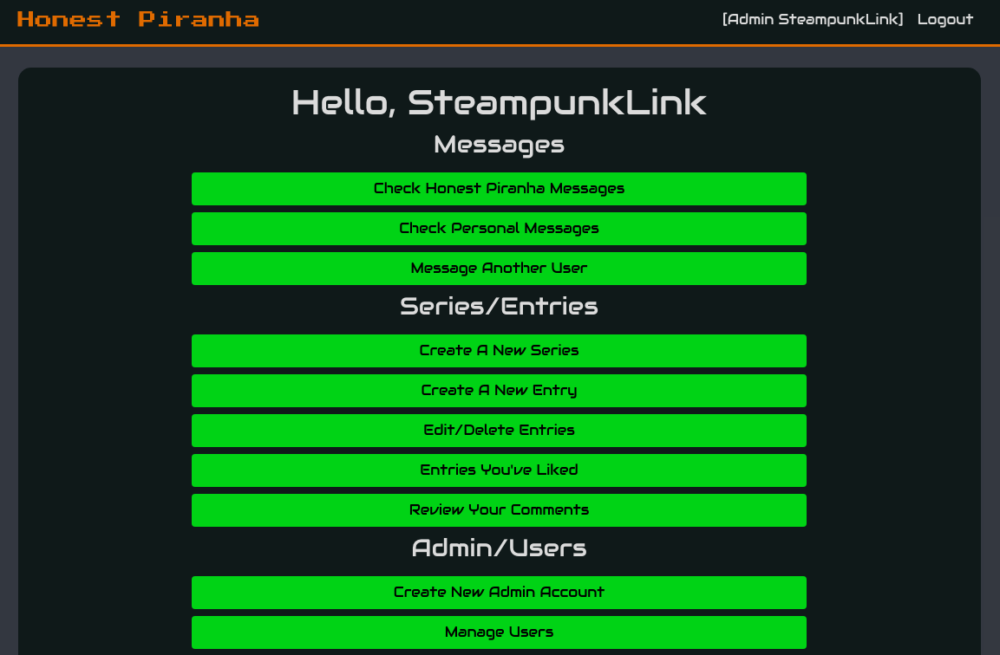

### Messages

Admins can message other users and check their own messages just like regular users. However, they also have an option called "Check Honest Piranha Messages" which lets them check tickets sent to the site by other users. They can choose to close a ticket with a response to the original sender or without sending one. You may notice that there is a blue border on the left side of the ticket displayed below...

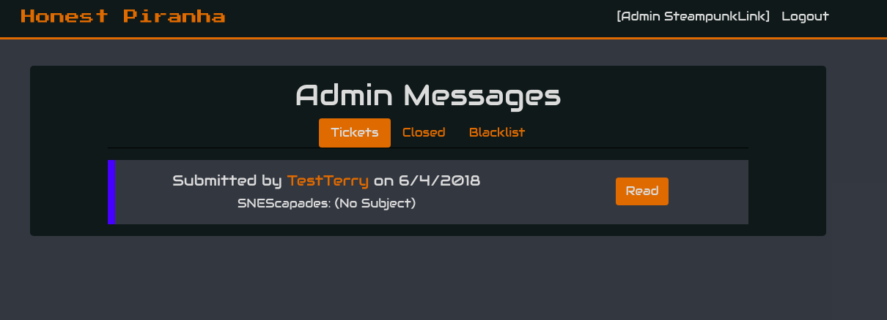

This one is blue because the content of the message hasn't triggered the comment coding system. By default, all messages are labeled as "code-blue", however, if a user uses certain words, this will be found automatically and make the message either "code-yellow" or "code-red" depending on what they've said. This gives administrators a head's up that the user may be using offensive language.

It should be noted that the words that trigger "code-yellow" and "code-red" status are not allowed to be used in the usernames a user sets up. If a user tries to use one, they will be asked to pick another name.

Finally, there are tabs for "Closed" and "Blacklist". Admins have the ability to set a "blacklist" status on a user from the "Manage Users" option in the main admin dashboard. This lets admins quarantine messages and comments from users who have demonstrated unhelpful or toxic behavior in the past.

### Series/Entries

"Entries You've Liked" and "Review Your Comments" work just like they do for standard users. "Create a New Series" lets the admin create a new series. They will be required to mark the new series as a video, podcast, or blog series.

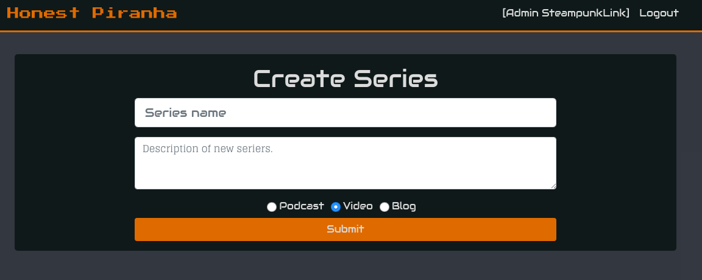

"Create New Entry" lets the admin create a new entry that will appear for visitors and users on the main page. When they select video, podcast, or blog, the dropdown list of series names will update with the names of series for that particular entry type.

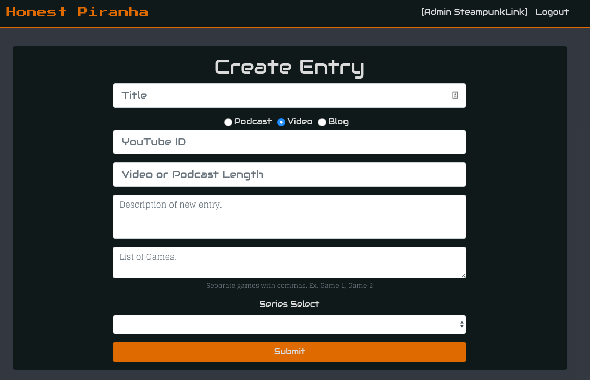

"Edit/Delete Entries" will display a list of entries giving the admin the option to edit or delete each one.

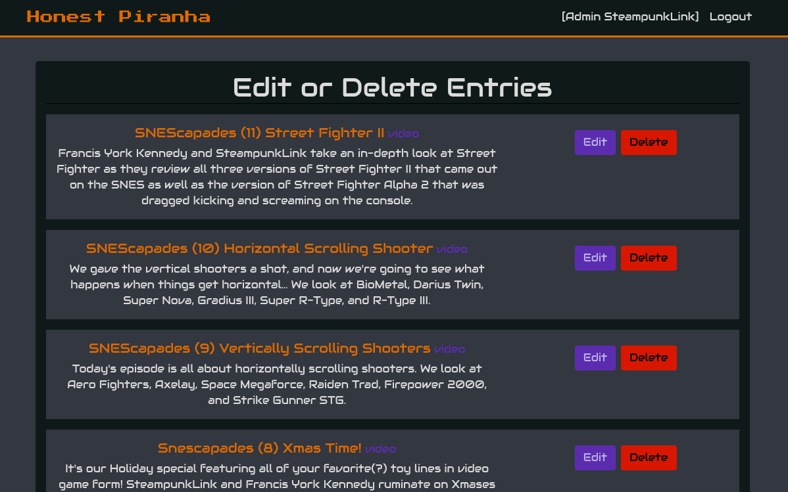

Editing the entry will update the entry data in the database. Deleting the entry will drop it from the database entirely and can't be undone. Admins will be warned of this when they click the delete button to prevent accidental deletions.

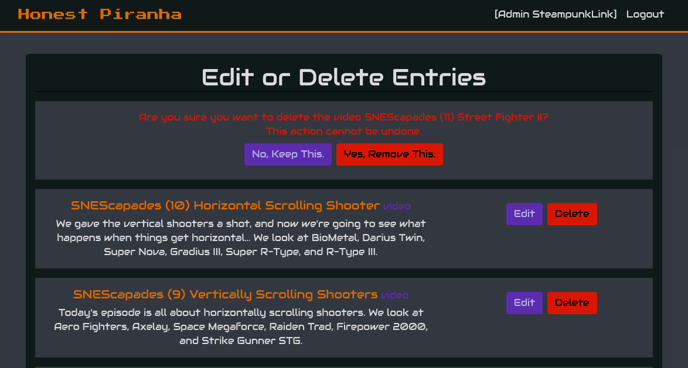

### Admin/Users

Admin have the same "Users You've Blocked" and "Update Email Address" options that regular users. Admin can also "Create New Admin Account" which is self-explanatory. They also have the "Manage Users" button. This generates a list of the site's users and the admin can chose to blacklist or ban a user if needed. Blacklist will cause all of the user's tickets and comments to be quarantined. Any tickets or comments from such users won't show up in the regular queue. They can still be viewed if the admin wants to, but they are much easier to ignore.

Blacklisted users are not told they have been blacklisted. Sometimes, the best way to deal with toxic people is to let them shout into the void and be ignored for all eternity. :)

In extreme cases, users can get banned. This will prevent them from being able to log in and they will not be able to use the same email address to create another account.

Users can be unblocked or unbanned if an admin chooses to.

### Moderate Comments

Finally, admin can approve comments. Approved comments show up in the comment section for the entry they were created for. Comments are subject to the same color coding system as the tickets described above.
